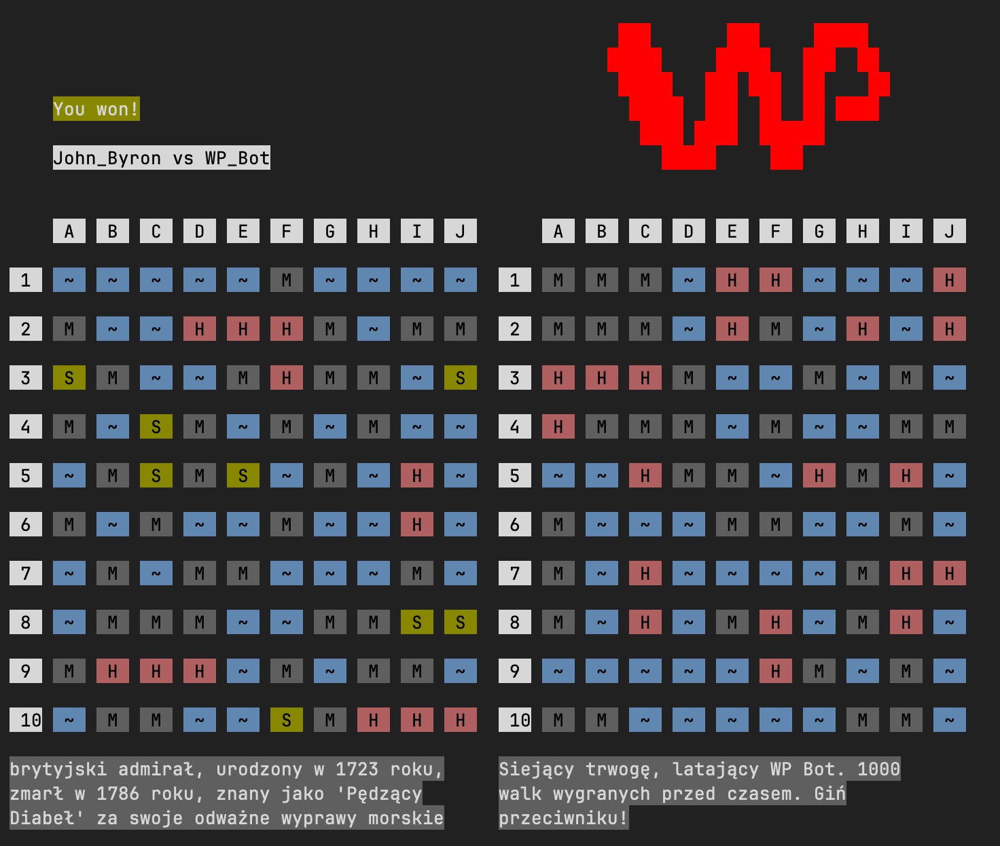

# Warships-GUI

Warships-GUI provides an advanced graphical user interface 
for the `Warships Online` game.



This package is suggested for advanced-beginners. If you want a simpler
take on GUI development, please check out the `Warships-LightGUI` package:
http://github.com/grupawp/warships-lightgui

## Installation

```
go get github.com/grupawp/warships-gui/v2
```

## Quick Start

### Create and display a single board:

```go
package main

import (
	"context"

	gui "github.com/grupawp/warships-gui/v2"
)

func main() {
	ui := gui.NewGUI(true)

	board := gui.NewBoard(1, 1, nil)
	ui.Draw(board)

	states := [10][10]gui.State{}
	for i := range states {
		states[i] = [10]gui.State{}
	}
	board.SetStates(states)

	ctx := context.Background()
	ui.Start(ctx, nil)
}

```

### Display text

```go
package main

import (
	"context"

	gui "github.com/grupawp/warships-gui/v2"
)

func main() {
	ui := gui.NewGUI(true)
	txt := gui.NewText(1, 1, "Press Ctrl+C to exit", nil)
	ui.Draw(txt)
	ui.Start(context.TODO(), nil)
}
```

### Listen for pressed coordinates
```go
package main

import (
	"context"
	"fmt"

	gui "github.com/grupawp/warships-gui/v2"
)

func main() {
	ui := gui.NewGUI(true)

	txt := gui.NewText(1, 1, "Press on any coordinate to log it.", nil)
	ui.Draw(txt)
	ui.Draw(gui.NewText(1, 2, "Press Ctrl+C to exit", nil))

	board := gui.NewBoard(1, 4, nil)
	ui.Draw(board)

	go func() {
		for {
			char := board.Listen(context.TODO())
			txt.SetText(fmt.Sprintf("Coordinate: %s", char))
			ui.Log("Coordinate: %s", char) // logs are displayed after the game exits
		}
	}()

	ui.Start(context.TODO(), nil)
}
```


## Documentation
https://pkg.go.dev/github.com/grupawp/warships-gui/v2
